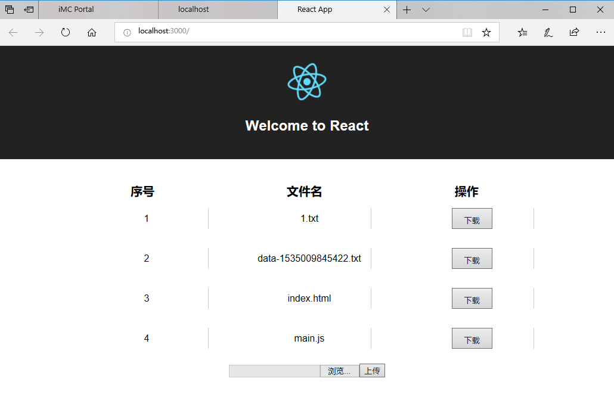

# FlieManage-Nodejs-Express

Nodejs在线文件管理工具，Nodejs-Express-前后端分离-跨域


## Nodejs 在线文件管理工具(需求设计部分)

### 一、设计需求

1. 文件列表展示
2. 文件的上传下载

### 二、所用的知识点，模块

1. fs
2. path
3. express
4. body-parser
5. multer

### 二、整体设计步骤

#### 1. 前端是基于 React 的 create-react-app 项目来实现

（1）项目初始化

> `npx create-react-app my-app`

> `cd my-app`

> `yarn start`

（2）前端项目获取后端数据，proxy 数据跨域访问，制作前端的显示页面；


### 2. 后端是基于 Express 的框架来做


### 3. 跨域

（1）在前端的 package.json 文件中设置

> `"proxy":http://localhost:8000`

（2）后端是通过设置响应头header 中的content-type来提供跨域请求

> `    res.writeHead(200, {'Content-Type': 'application/json;charset=utf-8'});
`

### 4. 功能实现

（1）前端项目实现跨域获取后端数据

（2）展示数据到前端页面中

（3）前端框架进行文件的上传功能

（4）前端框架进行文件的下载功能


### FlieManage-Nodejs-Express 项目介绍
简单的实现了文件的展示、上传、下载，实现前后端项目分离，前端项目跨域获取后端数据；这个文件夹包含了两个项目：前端项目为my-react-app，后端项目为my-express

### DEMO
（无）

### 安装教程

1.*下载包 *

```m
> https://github.com/Geek-LHJ/FlieManage-Nodejs-Express.git
```
2.*先进入后端项目 ：my-express,安装依赖并运行项目*
```m
> cd FlieManage-Nodejs-Express\my-express
> npm install
> npm start
```
*可在本地打开 localhost:8000/list 下查看*

3.*再进入前端项目：my-react-app，安装依赖并运行项目*

```m
> cd FlieManage-Nodejs-Express\my-react-app
> yarn install
> yarn start
```
*可在本地打开 localhost:3000 下查看*


### 使用说明

> 先运行后端项目：my-express

>> `npm start` 
在浏览器里面输入下面端口并打开：http://localhost:8000/list

> 再运行前端项目：my-react-app

>> `npm start` 
在浏览器里面输入下面端口并打开：http://localhost:3000

**我们可以在前端项目里面看到后端项目提供的数据，同时还可以导入新文件和下载目录中的文件**

### 运行效果截图

### 1.后端数据展示图:http://localhost:8000/list


### 2.前端页面展示图:http://localhost:3000



